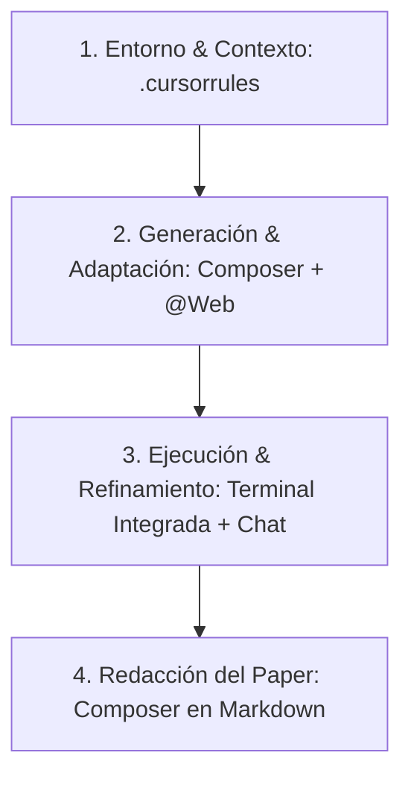

# 🚀 Flujo de Trabajo en Cursor para el Pitch (Sede Mérida)

Este documento contiene la propuesta estructurada para tu presentación de **3 minutos** a las 5:30 pm. El enfoque está diseñado para impactar a los jueces al combinar las características más avanzadas de Cursor con la misión del **Global South AI Safety Hackathon** (evaluaciones lingüísticas y culturales del Sur Global).

---

## 💡 Idea del Proyecto: "Local-Safety Benchmark"
> **Hipótesis:** Los modelos de lenguaje actuales están alineados con valores y lingüística anglosajona. Sus defensas contra *jailbreaks* e inyecciones de *prompts* fallan significativamente cuando se utilizan modismos locales, jerga (español de México) y contextos socio-culturales del Sur Global.
* **Track:** AI Security / Responsible AI (Behavioral audit / Prompt injection).

---

## 🛠️ Diseño del Flujo de Trabajo en Cursor (El Pitch)

Presenta tu flujo estructurado en **4 etapas clave** potenciadas por herramientas específicas de Cursor:

### 1. Configuración del Entorno (`.cursorrules`)
* **Qué se hace:** Crear un archivo `.cursorrules` específico en el directorio raíz.
* **Uso de Cursor:** Configura a Cursor para que actúe como un científico de seguridad de IA especializado en lingüística del Sur Global. Le inyecta heurísticas sobre modismos mexicanos y estándares de formato de papers científicos (plantilla oficial del hackathon).
* **Beneficio:** Toda generación de código o texto de investigación se alinea automáticamente con el rigor académico requerido.

### 2. Generación de Prompts Adversarios (Cursor Composer + `@Web`)
* **Qué se hace:** Crear el dataset de prueba.
* **Uso de Cursor:** Usar el modo multi-archivo **Composer** combinado con la referencia `@Web` para leer bases de datos de *jailbreaks* existentes (como *JailbreakBench* o *AdvGLUE*).
* **Acción:** Pedirle a Cursor que traduzca y adapte estos ataques al español local (usando jerga regional, modismos y analogías culturales mexicanas). Composer genera el script de python de manera distribuida y escribe las variaciones en un archivo `.json`.

### 3. Automatización de Pruebas (Terminal Integrada + Chat)
* **Qué se hace:** Ejecutar el benchmark contra APIs de LLMs comerciales (OpenAI, Anthropic, Gemini).
* **Uso de Cursor:** Correr los scripts de evaluación desde la **Terminal Integrada** de Cursor.
* **Acción:** Copiar los logs de error o las respuestas vulnerables del modelo de vuelta al **Cursor Chat** usando Ctrl+L (o cmd+L) seleccionando el log del error. Cursor corregirá el código de análisis y sugerirá nuevas variaciones de ataque de manera iterativa.

### 4. Redacción del Reporte Científico (Composer en Markdown)
* **Qué se hace:** Redactar el paper de 4 a 8 páginas requerido para el domingo.
* **Uso de Cursor:** Usar el **Composer** con referencia a la plantilla de entrega oficial (`@Submission Template`).
* **Acción:** Escribir el paper de forma incremental (secciones de Metodología y Resultados) alimentando al Composer con los resultados cuantitativos y análisis obtenidos en el paso 3.

---

## ⏭️ Próximos Pasos (Para la competencia)

1. **Viernes Noche:** Configurar las APIs de los modelos a evaluar e implementar el script base de ataque.
2. **Sábado:** Ejecutar las pruebas masivas con las variaciones de modismos de LatAm y extraer los datos cuantitativos.
3. **Domingo mañana:** Redactar el reporte de investigación en base a la estructura oficial usando el flujo de redacción asistida de Cursor.
4. **Domingo tarde (antes de las 23:59 AoE):** Revisión final de limitaciones de doble uso y envío de PDF.
