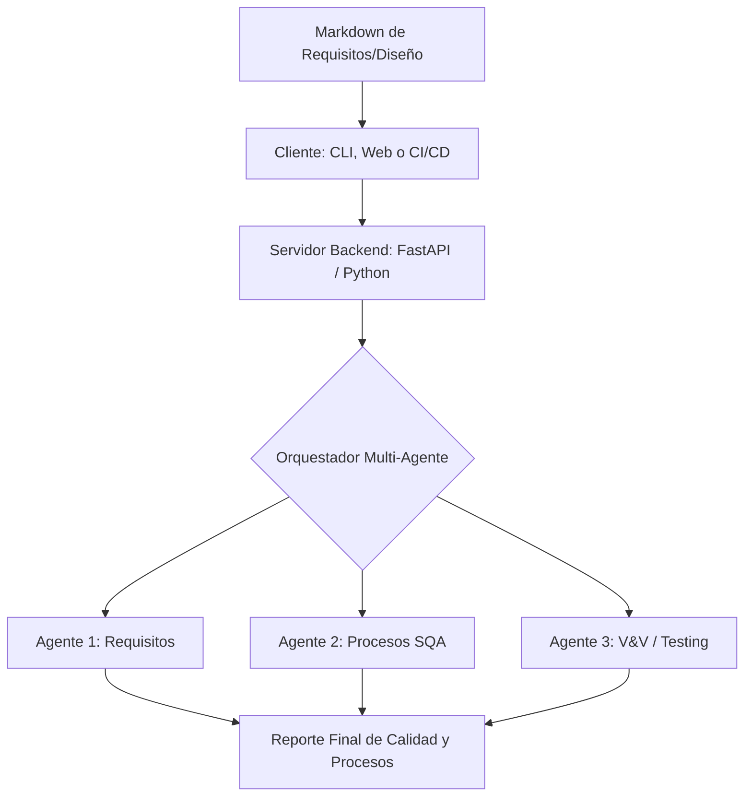

# 📋 Análisis de APIs y Viabilidad: Servidor Independiente de Gobernanza SQA

Al diseñar el **Process-Guard** como un **Servidor de Aplicación Independiente (Agnóstico del Editor)**, eliminamos las restricciones y limitaciones de integración propietarias de Cursor. Esto permite crear una herramienta mucho más flexible y potente que puede utilizarse en local, en la web o integrarse en pipelines de integración continua (CI/CD).

---

## 🔍 ¿Cursor permite ejecución multimodelo secuencial programática?

**La respuesta corta es NO de forma nativa/programática.**

### Capacidades Reales de Cursor con Múltiples Modelos:
1. **Ejecución Paralela Competitiva ("Use Multiple Models"):** Cursor permite en su interfaz de usuario correr un mismo prompt en paralelo con múltiples modelos diferentes a la vez (por ejemplo, Claude y GPT-4). Sin embargo, esto es un enfoque competitivo ("el mejor de N") donde cada modelo crea una propuesta aislada (usando ramas temporales de git) para que el desarrollador las compare lado a lado. **No es una ejecución en cadena** (el modelo A no alimenta al modelo B).
2. **Modo Agente / Planificador vs. Ejecutor:** En las versiones Cursor 2.0+, la herramienta tiene un modo agente cerrado que divide la planificación (un modelo diseña los pasos) y la ejecución (otro modelo escribe el código). Sin embargo, esto es propietario de Cursor, es de caja cerrada y no ofrece una API abierta para que programes tu propio flujo secuencial multimodelo.

### La Solución con nuestro Servidor Independiente:
Dado que Cursor no tiene una API para programar cadenas secuenciales de modelos, **nuestro Servidor Independiente en FastAPI/Python sí lo puede hacer de forma transparente**.
El servidor se encarga de orquestar la secuencia (llamar a la API 1 con Gemini, luego con Claude, etc.) utilizando los SDKs nativos de cada proveedor y entregando los 9 artefactos consolidados de vuelta al usuario.

---

## 🏗️ Arquitectura Tecnológica del Servidor

El servidor se puede construir como una API REST o un servicio web independiente utilizando tecnologías estándar de la industria:

### 1. Backend: FastAPI (Python)
* **Por qué Python:** Es la plataforma líder para el ecosistema de IA. FastAPI permite construir endpoints REST ultra rápidos, asíncronos y con documentación interactiva integrada de forma nativa.

### 2. Framework de Orquestación Multi-Agente
En lugar de llamadas a prompts individuales, un framework independiente permite definir roles, tareas e interacciones complejas de calidad de software:
* **CrewAI:** Ideal para definir "equipos" de agentes que colaboran de manera jerárquica o secuencial. Podemos definir la "Tripulación de SQA" donde el Agente de Requisitos le pasa sus observaciones al Agente de SQA general, y este último consolida el reporte.
* **LangGraph:** Ofrece control total sobre flujos cíclicos de agentes (por ejemplo, si el agente de SQA detecta un error, puede devolver el Markdown al agente de Requisitos para que proponga una corrección y volver a evaluar).

---

## 🧠 APIs Clave a Utilizar (Procesamiento de IA)

| API / SDK | Rol en la Aplicación | Ventajas |
| :--- | :--- | :--- |
| **Google Gemini API SDK** (`google-genai`) | Procesador de Contexto Masivo | Gemini posee una ventana de contexto de **2 millones de tokens**. Esto permite enviar no solo los Markdowns de documentación, sino la base de código completa del proyecto para que los agentes verifiquen si el código realmente coincide con los requisitos especificados (trazabilidad real). |
| **Anthropic Claude API** | Agente Evaluador Jefe (Galin / SWEBOK) | Su excelente razonamiento lógico lo hace el agente perfecto para tomar la decisión final sobre si el proyecto aprueba o no la auditoría de calidad. |
| **OpenAI API** | Rápido, estructurado (JSON estructurado nativo fiable). | Costo medio, sin ventanas de contexto gigantes. | Generación de la Matriz de Trazabilidad en JSON limpio. |

---

## 🔄 Flujo del Caso de Uso General (Agnóstico)

El desarrollador o equipo puede consumir el servidor de tres maneras diferentes:

1. **Interfaz Web (Dashboard en Next.js / Streamlit):**
   * El usuario arrastra su carpeta de proyecto.
   * La interfaz muestra un progreso visual mientras los agentes evalúan.
   * Entrega un dashboard visual con gráficos de cobertura de procesos y el reporte de mejoras.
2. **Herramienta de Línea de Comandos (CLI):**
   * Ejecutar en terminal: `process-guard audit ./proyecto`
   * Sube los markdowns relevantes al servidor local o en la nube, procesa y escribe el resultado directo en consola o genera un archivo `REPORTE_SQA.md` local.
3. **GitHub Action (Integración Continua):**
   * Corre automáticamente en la nube.
   * Comenta los hallazgos directamente en el Pull Request.

---

## ✅ Limitaciones Resueltas al no depender de Cursor

* **Uso libre de APIs:** Puedes utilizar tus propias claves de API (`GEMINI_API_KEY`, `ANTHROPIC_API_KEY`) directamente en las variables de entorno del servidor.
* **Gobernanza Proactiva:** El servidor puede enviar alertas activas (Slack, Discord, Emails) si un proceso crítico de calidad se rompe en producción.
* **Compatibilidad:** El sistema funciona para desarrolladores que usen VS Code, Vim, Cursor, o programadores que desarrollen sin usar editores con IA integrados.
