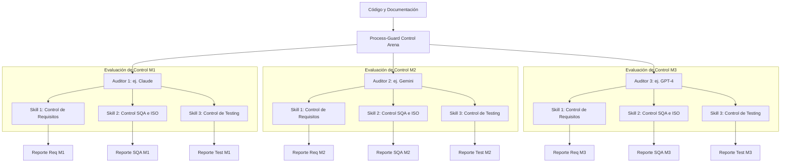

# Process-Guard Control Arena: Framework de AI Control en Cursor

Esta arquitectura define el prototipo de **Process-Guard**, pero ahora pivotado hacia el track de **AI Control** (AI Security), tomando inspiración en entornos de evaluación como **Linux Arena**. 

El objetivo principal es resolver el problema de la **"Guerra del Código de IA"**: el desarrollo ad-hoc asistido por IA donde el código se genera rápidamente, pero la ingeniería de software y los procesos desaparecen, generando una inmensa deuda técnica, alucinaciones y vulnerabilidades.

Process-Guard no es solo una herramienta, sino un **nuevo marco de referencia de desarrollo** integrado en la API de Cursor. Obliga al código y a la arquitectura a pasar por una "Arena de Control" estricta basada en el estándar SWEBOK, usando modelos de IA como auditores implacables.

---

## La "Arena de Control" Multi-Modelo

Para garantizar el control y evitar depender de las alucinaciones de un único LLM, el sistema selecciona **3 modelos de lenguaje disponibles** en el entorno (ej. Claude, Gemini, GPT-4). 

Cada modelo actúa de manera independiente en la "Arena" ejecutando **3 tareas/skills especializadas de control de calidad**, generando un total de **9 reportes de auditoría** para comparar y cruzar resultados (validación cruzada).

---

## Las 3 Skills Especializadas de la Arena (Evaluación SWEBOK)

### 1. Skill 1: Control de Requisitos
* **Objetivo:** Analizar la especificación técnica en busca de "huecos raros", ambigüedades, y asegurar que el código generado no se haya desviado del requerimiento inicial.
* **Resultado:** Auditorías (`requisitos_modelo[1-3].md`).

### 2. Skill 2: Control de Arquitectura y Procesos SQA (Galin / ISO)
* **Objetivo:** Evaluar la gobernanza técnica. ¿El código respeta modularidad? ¿Existen procesos de desarrollo o es solo código "escupido" por IA?
* **Resultado:** Reportes de conformidad de procesos (`sqa_modelo[1-3].md`).

### 3. Skill 3: Control de Verificación y Testing
* **Objetivo:** Validar si existen criterios de aceptación y pruebas críticas de regresión para contener posibles fallos introducidos por generaciones automatizadas.
* **Resultado:** Planes de auditoría de pruebas (`testing_modelo[1-3].md`).

---

## Consenso y Resultados: El Veredicto de la Arena

Al finalizar, la API consolida una matriz con los **9 reportes generados**. Al igual que en *LMSYS Chatbot Arena* o *Linux Arena*, se busca el consenso o se exponen las discrepancias.

| Especialidad (Control) | Auditor 1 | Auditor 2 | Auditor 3 | Veredicto Final de Control |
| :--- | :--- | :--- | :--- | :--- |
| **Control de Requisitos** | `req_m1.md` | `req_m2.md` | `req_m3.md` | *Cruces y discrepancias en lógica.* |
| **Arquitectura SQA** | `sqa_m1.md` | `sqa_m2.md` | `sqa_m3.md` | *Evaluación de la deuda técnica.* |
| **Testing** | `test_m1.md` | `test_m2.md` | `test_m3.md` | *Validación cruzada de seguridad y QA.* |

### Propuesta de Valor ante el Jurado
1. **Alineación con AI Control:** Demuestra un mecanismo estricto donde la IA vigila a la IA ("Controladores") para evitar resultados nocivos.
2. **Combate la "Guerra del Código":** Restaura los procesos de Ingeniería de Software que el *live coding* y la generación rápida han destruido.
3. **Escalabilidad:** Implementado directamente en la API de Cursor para interceptar los errores de forma nativa en el flujo de trabajo del desarrollador.
