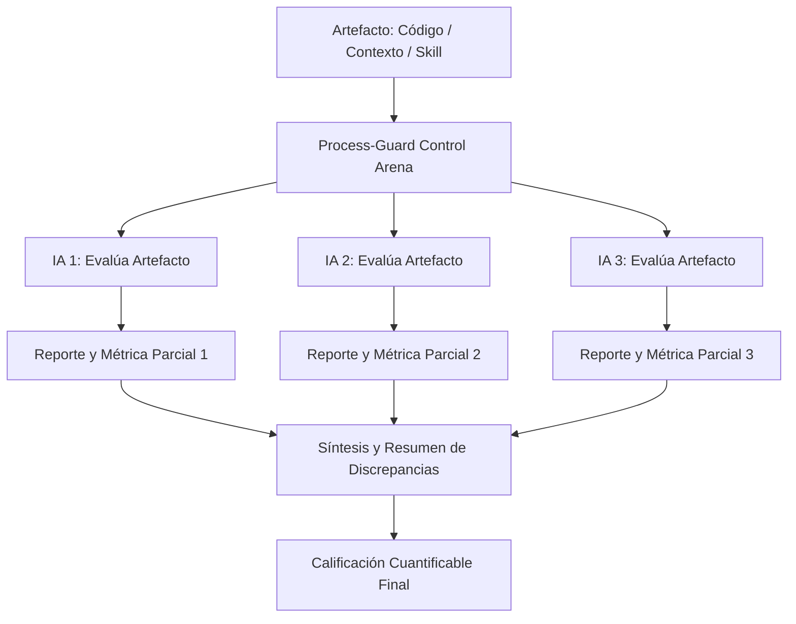

# Process-Guard Control Arena: Framework de AI Control

Esta arquitectura define el prototipo de **Process-Guard**, enfocado en el track de **AI Control** (AI Security) e inspirado en **Linux Arena**.

## 1. El Problema: "La Guerra del Código"
Actualmente, el uso indiscriminado de IA para generar software omite los procesos de ingeniería de software (SWEBOK). Esto genera una acumulación peligrosa de deuda técnica, bugs (hasta un 80% más según estimaciones por falta de procesos formales) y vulnerabilidades por alucinaciones ("le pides que sume dos y suma tres").

## 2. La "Arena de Control" Multi-Modelo
La principal evolución de Process-Guard es que **no evalúa solo código final**. Cualquier parte del proyecto (artefacto) puede ser subida a la Arena de Control para su revisión a lo largo del ciclo de vida del software:
* Un archivo de contexto.
* Un documento de requisitos.
* Una "Skill" o instrucción específica.
* El proyecto de software completo.

La herramienta utiliza **3 Modelos de IA distintos** (ej. Claude, Gemini, GPT-4) para comprender y calificar estos artefactos basándose en **métricas, procesos de ingeniería de software y el ciclo de vida del producto**.

### Flujo de Trabajo por Tarea (Task)
Un proyecto de software se divide en múltiples tareas (ej. Tarea 1: Validar Requisitos, Tarea 2: Validar Contexto, Tarea 3: Validar Código). Para cada tarea, el flujo de ejecución en la Arena es el siguiente:

1. **Subida del Artefacto:** El usuario sube a la plataforma el artefacto a evaluar.
2. **Evaluación Triple Simultánea:** Las 3 IAs auditan y analizan el *mismo* artefacto.
3. **Reportes Individuales:** Cada IA genera un reporte de auditoría detallado y asigna una métrica parcial.
4. **Veredicto y Cuantificación Final:** Un proceso de síntesis recoge los 3 reportes, genera un **resumen consolidado** (destacando acuerdos y discrepancias para evitar alucinaciones) y emite una **calificación cuantificable final** que dictamina si el artefacto es seguro y usable.

## 3. Beneficios
* **Mitigación de Alucinaciones:** Al cruzar las evaluaciones de 3 modelos, si un modelo alucina aprobando un proceso inseguro, los otros dos lo penalizarán.
* **Trazabilidad Completa:** Se puede evaluar el proyecto en *todas* las fases de su ciclo de vida, no solo al programar.
* **Objetividad Cuantificable:** Convierte la calidad del software, que suele ser cualitativa o subjetiva, en una métrica estricta y medible.
