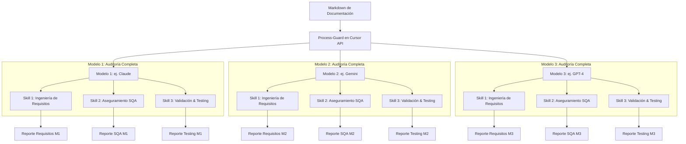

# Process-Guard: Auditoría de SQA Multi-Modelo en Cursor

Esta arquitectura define el prototipo de **Process-Guard** integrado en la API del editor Cursor. El sistema selecciona **3 modelos de lenguaje disponibles** en el entorno y hace que cada uno de ellos actúe de manera independiente para ejecutar **3 tareas/skills especializadas de calidad**, generando un total de **9 reportes de auditoría** para comparar y cruzar resultados.

---

## Flujo de Ejecución por Modelo

El flujo distribuye el análisis del proyecto a través de **3 modelos de IA concurrentes**. Cada modelo es responsable de ejecutar la auditoría de las 3 áreas de SQA definidas:

---

##  Las 3 Skills/Tareas Especializadas (Ejecutadas por cada Modelo)

Cada uno de los 3 modelos ejecuta de manera independiente las siguientes tareas sobre los archivos Markdown del proyecto:

### 1. Skill 1: Ingeniería de Requisitos (Estándar SWEBOK)
* **Objetivo:** Analizar la especificación técnica en busca de "huecos raros", ambigüedades lógicas, requerimientos incompletos o inconsistentes.
* **Resultado:** Cada modelo genera su propia auditoría de requisitos (`requisitos_modelo1.md`, `requisitos_modelo2.md`, `requisitos_modelo3.md`).

### 2. Skill 2: Procesos y Arquitectura SQA (Estándares Galin / ISO 25010)
* **Objetivo:** Evaluar la gobernanza del proceso de desarrollo, la modularidad y mantenibilidad descritas en el diseño del software.
* **Resultado:** Cada modelo genera su reporte de conformidad de procesos (`sqa_modelo1.md`, `sqa_modelo2.md`, `sqa_modelo3.md`).

### 3. Skill 3: Verificación y Validación - SQ (Testing)
* **Objetivo:** Verificar si la planificación incluye criterios de aceptación robustos para cada caso de uso y pruebas críticas de regresión/fallo.
* **Resultado:** Cada modelo genera su plan de auditoría de pruebas (`testing_modelo1.md`, `testing_modelo2.md`, `testing_modelo3.md`).

---

## Matriz de Comparación y Consenso de Resultados

Al finalizar el proceso, la API de Cursor consolida una matriz con los **9 reportes generados**, agrupados por especialidad para facilitar la detección de discrepancias:

| Especialidad | Reporte Modelo 1 (ej. Claude) | Reporte Modelo 2 (ej. Gemini) | Reporte Modelo 3 (ej. GPT-4) | Estado de Consenso / Hallazgos |
| :--- | :--- | :--- | :--- | :--- |
| **Ingeniería de Requisitos** | `requisitos_m1.md` | `requisitos_m2.md` | `requisitos_m3.md` | *Comparación de discrepancias en la especificación.* |
| **Aseguramiento SQA** | `sqa_m1.md` | `sqa_m2.md` | `sqa_m3.md` | *Consenso sobre la conformidad y arquitectura del proceso.* |
| **Validación y Testing** | `testing_m1.md` | `testing_m2.md` | `testing_m3.md` | *Validación cruzada sobre los planes de pruebas planteados.* |

### Beneficio de esta Estructura de Prototipo:
* **Confiabilidad:** Permite contrastar de inmediato cómo evalúa cada LLM el mismo código/diseño de software. Si Claude detecta un error de testing crítico pero Gemini y GPT-4 lo omiten, el desarrollador puede investigar la discrepancia directamente.
* **Integración en la API de Cursor:** La extensión lee los modelos configurados por el usuario y los dispara de forma secuencial o paralela según las capacidades de la API de Cursor en ese momento.
