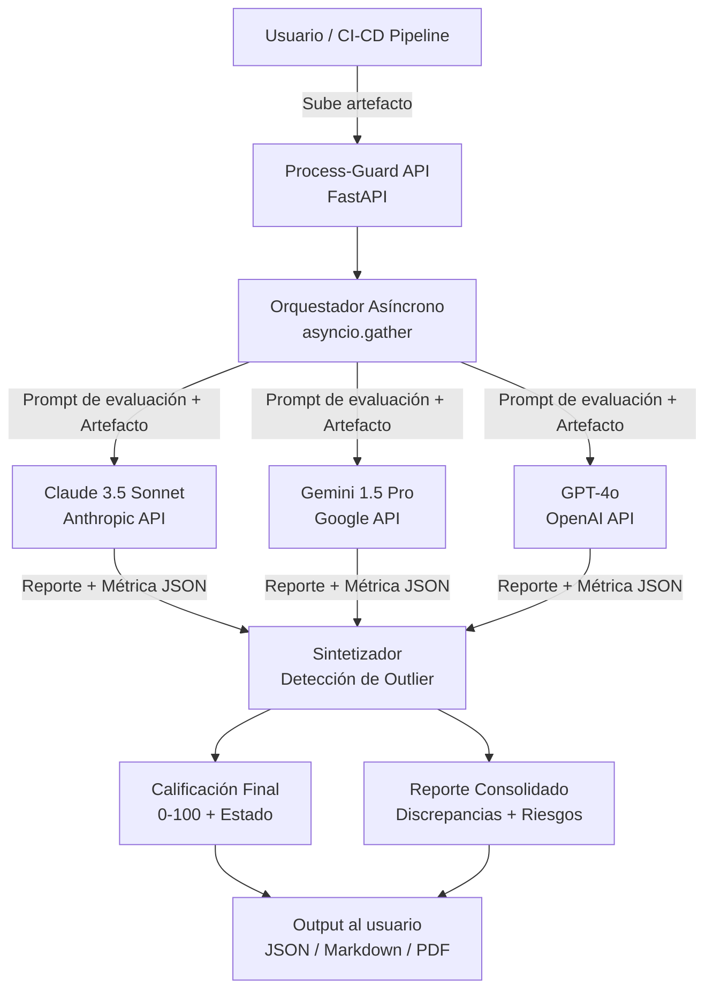
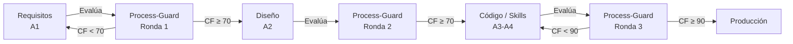

# TAREA 2 — Diseño del Framework Process-Guard
**Responsable:** Integrante 2  
**Entrega interna:** Sábado 20 de junio, tarde  
**Secciones del paper:** Sección 3 (Methods), figuras de arquitectura

---

## Objetivo General

Diseñar con precisión la **arquitectura técnica y el protocolo de evaluación** de Process-Guard Control Arena, documentarlo de forma replicable para el paper, y producir las figuras/diagramas que lo ilustran. Esta sección es el corazón del paper; los jueces evalúan si la metodología es rigurosa y reproducible.

---

## Contexto del Proyecto

Process-Guard envía un **artefacto** (código, documento de requisitos, skill, contexto) a 3 LLMs distintos simultáneamente. Cada modelo lo evalúa contra rúbricas basadas en SWEBOK/ISO 25010, produce un reporte individual con una métrica parcial (0–100), y un **sintetizador** consolida los 3 reportes detectando discrepancias (alucinaciones) y emitiendo una calificación final.

**Stack tecnológico actual:** FastAPI + Python, Anthropic SDK, Google Generai SDK, OpenAI SDK.

---

## Sub-tareas Detalladas

### 2.1 Definición Formal de "Artefacto" y Tipos de Evaluación (1–2 horas)

El sistema debe ser capaz de evaluar distintos tipos de artefactos a lo largo del ciclo de vida del software. Definir formalmente:

**Tipos de Artefactos Soportados:**

| ID | Tipo | Descripción | Fase del Ciclo de Vida |
|----|------|-------------|------------------------|
| A1 | Documento de Requisitos | Markdown con especificaciones funcionales y no funcionales | Análisis |
| A2 | Documento de Diseño | Arquitectura, diagramas, decisiones de diseño | Diseño |
| A3 | Skill / Instrucción de Sistema | Prompt del sistema o "skill" para un agente de IA | Construcción |
| A4 | Fragmento de Código | Función, módulo o clase específica | Construcción |
| A5 | Proyecto Completo | Repositorio o conjunto de archivos | Integración/Release |

Para cada tipo, definir qué **áreas de SWEBOK** aplican (ver sub-tarea 2.2).

---

### 2.2 Diseño de las Rúbricas de Evaluación (SWEBOK + ISO 25010) (3–4 horas)

Este es el núcleo técnico. Los 3 LLMs evalúan el artefacto contra criterios formales. Diseñar el **prompt de evaluación** que se enviará a cada modelo.

#### Estructura del Prompt de Evaluación (por artefacto)

```
Eres un auditor senior de Ingeniería de Software certificado en SWEBOK v3.0 e ISO 25010.
Tu tarea es evaluar el siguiente artefacto de software: [TIPO_ARTEFACTO]

ARTEFACTO:
---
[CONTENIDO_DEL_ARTEFACTO]
---

Evalúa el artefacto según los siguientes criterios. Para cada criterio:
1. Determina si aplica al tipo de artefacto
2. Asigna una puntuación de 0 a 10
3. Justifica la puntuación en 1-2 oraciones
4. Identifica hallazgos críticos (si los hay)

CRITERIOS DE EVALUACIÓN:
[TABLA DE CRITERIOS SEGÚN TIPO DE ARTEFACTO]

FORMATO DE SALIDA (JSON estricto):
{
  "criterios": [
    {"id": "C1", "nombre": "...", "aplica": true/false, "puntuacion": 0-10, "justificacion": "...", "hallazgos": ["..."]}
  ],
  "metrica_parcial": 0-100,
  "resumen_ejecutivo": "...",
  "riesgos_criticos": ["..."],
  "recomendaciones": ["..."]
}
```

#### Tabla de Criterios por Tipo de Artefacto

**Para A3 (Skill/Instrucción) y A4 (Código) — basada en ISO 25010:**

| ID | Criterio | SWEBOK / ISO | Peso |
|----|----------|--------------|------|
| C1 | Completitud funcional | ISO 25010 § Functional Suitability | 15% |
| C2 | Corrección funcional | ISO 25010 § Functional Correctness | 15% |
| C3 | Seguridad — Validación de inputs | SWEBOK § Software Security / OWASP | 20% |
| C4 | Mantenibilidad — Modularidad | ISO 25010 § Maintainability | 10% |
| C5 | Mantenibilidad — Documentación | SWEBOK § Software Maintenance | 10% |
| C6 | Fiabilidad — Manejo de errores | ISO 25010 § Reliability | 15% |
| C7 | Trazabilidad con requisitos | SWEBOK § Software Requirements | 10% |
| C8 | Portabilidad / Compatibilidad | ISO 25010 § Portability | 5% |

**Para A1 (Requisitos):**

| ID | Criterio | Fuente | Peso |
|----|----------|--------|------|
| C1 | Completitud (todos los casos cubiertos) | SWEBOK § Requirements | 20% |
| C2 | Consistencia interna (sin contradicciones) | SWEBOK § Requirements | 20% |
| C3 | No ambigüedad | IEEE 830 | 20% |
| C4 | Verificabilidad (se pueden probar) | SWEBOK § V&V | 20% |
| C5 | Trazabilidad (vinculados a objetivos) | SWEBOK § Requirements | 20% |

---

### 2.3 Fórmula de Calificación Final y Detección de Alucinaciones (2 horas)

Diseñar el **algoritmo del sintetizador** que consolida los 3 reportes.

#### Paso 1 — Normalización de Métricas Parciales

Cada modelo M_i emite una métrica parcial `s_i` (0–100).

#### Paso 2 — Detección de Discrepancia (Indicador de Alucinación)

```
desviacion_estandar = std([s1, s2, s3])
```

| Desviación Estándar | Interpretación | Acción |
|---------------------|----------------|--------|
| < 10 | Consenso alto — baja probabilidad de alucinación | Calificación = promedio ponderado |
| 10–20 | Discrepancia moderada — revisar criterios divergentes | Flag "Revisión Recomendada" |
| > 20 | Discrepancia alta — alucinación probable en uno de los modelos | Flag "Posible Alucinación Detectada" |

#### Paso 3 — Identificación del Modelo Atípico (Outlier)

Si `std > 20`, identificar el modelo cuya puntuación difiere más de la mediana:

```python
mediana = median([s1, s2, s3])
outlier = argmax([abs(s1 - mediana), abs(s2 - mediana), abs(s3 - mediana)])
```

El outlier es **penalizado** con un peso reducido en la calificación final.

#### Paso 4 — Calificación Final Ponderada

```
# Pesos normales (sin outlier)
CF = (s1 + s2 + s3) / 3

# Si hay outlier detectado (std > 20)
# El outlier recibe peso 0.1, los otros 0.45 cada uno
CF = 0.45 * s_consenso_1 + 0.45 * s_consenso_2 + 0.10 * s_outlier
```

#### Paso 5 — Categoría de Estado

| CF | Estado | Color |
|----|--------|-------|
| 90–100 | Aprobado — Listo para producción | Verde |
| 70–89 | Aprobado con observaciones | Amarillo |
| 50–69 | Requiere revisión — No pasar a siguiente fase | Naranja |
| 0–49 | Rechazado — Requiere rediseño | Rojo |

---

### 2.4 Diagrama de Arquitectura del Sistema (2 horas)

Producir los siguientes diagramas en formato Mermaid (para el paper) y/o imagen PNG:

#### Diagrama 1 — Flujo Principal (Figure 1 del paper)



#### Diagrama 2 — Ciclo de Vida del Software con Process-Guard (Figure 2)



---

### 2.5 Redacción — Sección 3 del Paper (2 horas)

Escribir la sección Methods con suficiente detalle para que alguien pueda replicar el sistema. Estructura sugerida:

**3.1 Overview del Framework**  
Descripción de alto nivel: qué entra, qué sale, por qué 3 modelos.

**3.2 Tipos de Artefactos y Rúbricas**  
Tabla de criterios por tipo (resultado de sub-tarea 2.2).

**3.3 Protocolo de Evaluación Multi-Modelo**  
Estructura del prompt, formato de salida JSON, parámetros de temperatura (T=0 para reproducibilidad).

**3.4 Sintetizador y Detección de Alucinaciones**  
Fórmulas de la sub-tarea 2.3 con notación matemática.

**3.5 Decisiones de Diseño Justificadas**  
- ¿Por qué 3 modelos y no 2 o 5? (mínimo para mayoría, máximo para costo/latencia)
- ¿Por qué modelos heterogéneos? (diferentes sesgos de entrenamiento → detección de outlier más robusta)
- ¿Por qué temperatura T=0? (reproducibilidad de la evaluación)
- ¿Por qué SWEBOK/ISO 25010? (estándares industriales ampliamente adoptados, no opiniones)

---

## Formato de Entrega

Entregar:
1. `paper_seccion_3_metodologia.md` — Sección 3 redactada (~600 palabras)
2. `rubrica_evaluacion.md` — Tablas de criterios por tipo de artefacto
3. `diagrams/figura_1_arquitectura.mmd` — Diagrama Mermaid de arquitectura
4. `diagrams/figura_2_ciclo_vida.mmd` — Diagrama de ciclo de vida

**Coordinar con:** Tarea 4 (el prototipo implementa lo que aquí diseñas — coordinar nombres de campos JSON y endpoint `/evaluate`).

---

## Criterios de Éxito (Rúbrica del Hackathon)

- [ ] La metodología es suficientemente detallada para replicarla
- [ ] Los criterios de evaluación están vinculados a estándares (SWEBOK/ISO) con referencias
- [ ] La fórmula de calificación final está formalizada matemáticamente
- [ ] El mecanismo de detección de alucinaciones está claramente descrito
- [ ] Las decisiones de diseño están justificadas con razonamiento
- [ ] Hay al menos 1 figura de arquitectura en el paper
