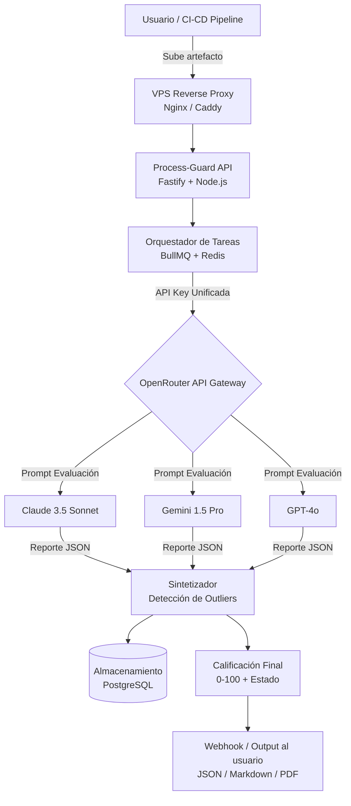

# TAREA 2 — Diseño del Framework Process-Guard
**Responsable:** Integrante 2  
**Entrega interna:** Sábado 20 de junio, tarde  
**Secciones del paper:** Sección 3 (Methods), figuras de arquitectura
**Estado:** ¡COMPLETADA! (Entregables ubicados en `tasks/entregables_tarea_2/`)

---

## Objetivo General

Diseñar con precisión la **arquitectura técnica y el protocolo de evaluación** de Process-Guard Control Arena, documentarlo de forma replicable para el paper, y producir las figuras/diagramas que lo ilustran. Esta sección es el corazón del paper; los jueces evalúan si la metodología es rigurosa y reproducible.

---

## Contexto del Proyecto

Process-Guard envía un **artefacto** (código, documento de requisitos, skill, contexto) a 3 LLMs distintos simultáneamente. Cada modelo lo evalúa contra rúbricas basadas en múltiples estándares de la industria, produce un reporte individual con una métrica parcial (0–100), y un **sintetizador** consolida los 3 reportes detectando discrepancias (alucinaciones) y emitiendo una calificación final.

**Stack tecnológico actual:** Fastify + Node.js (desplegado en un VPS con Nginx/Caddy), BullMQ + Redis para orquestación asíncrona, y OpenRouter API como gateway unificado para interactuar con los LLMs (Anthropic, Google, OpenAI).

---

## Sub-tareas Detalladas y Resultados

### 2.1 Definición Formal de "Artefacto" y Tipos de Evaluación

El sistema es capaz de evaluar distintos tipos de artefactos a lo largo del ciclo de vida del software.

| ID | Tipo | Descripción | Fase del Ciclo de Vida |
|----|------|-------------|------------------------|
| A1 | Documento de Requisitos | Markdown con especificaciones funcionales y no funcionales | Análisis |
| A2 | Documento de Diseño | Arquitectura, diagramas, decisiones de diseño (ADRs) | Diseño |
| A3 | Skill / Instrucción de Sistema | Prompt del sistema o "skill" para un agente de IA | Construcción |
| A4 | Fragmento de Código | Función, módulo o clase específica | Construcción |
| A5 | Proyecto Completo | Repositorio o conjunto de archivos | Integración/Release |

---

### 2.2 Diseño de las Rúbricas de Evaluación (Estándares ISO/IEEE/NIST/OWASP)

Las rúbricas definitivas están documentadas en `tasks/entregables_tarea_2/rubrica_evaluacion.md`. Se integraron los siguientes marcos de trabajo:
* **Requisitos (A1):** SWEBOK v3.0, ISO/IEC/IEEE 29148, BABOK.
* **Diseño (A2):** SWEBOK v3.0, ISO/IEC/IEEE 42010, TOGAF, NIST AI RMF.
* **Código y Skills (A3-A4):** ISO/IEC 25010, OWASP Top 10 para LLMs.

Adicionalmente, se integró una verificación nativa (compatibilidad de SDK) exclusiva para artefactos de tipo Skill (A3) aprovechando la orquestación.

---

### 2.3 Fórmula de Calificación Final y Detección de Alucinaciones

El sintetizador consolida los 3 reportes, calculando la desviación estándar de las métricas parciales.

```
desviacion_estandar = std([s1, s2, s3])
```

| Desviación Estándar | Interpretación | Acción |
|---------------------|----------------|--------|
| < 10 | Consenso alto — baja probabilidad de alucinación | Calificación = promedio ponderado |
| 10–20 | Discrepancia moderada — revisar criterios divergentes | Flag "Revisión Recomendada" |
| > 20 | Discrepancia alta — alucinación probable en uno de los modelos | Penalización al outlier |

Si `std > 20`, se penaliza al modelo cuya puntuación difiere más de la mediana:
```
# Si hay outlier detectado (std > 20)
CF = 0.45 * s_consenso_1 + 0.45 * s_consenso_2 + 0.10 * s_outlier
```

---

### 2.4 Diagrama de Arquitectura del Sistema

Se crearon dos diagramas ubicados en la carpeta `tasks/entregables_tarea_2/diagrams/` en formato `.md` para su correcta visualización en Obsidian.

**Arquitectura principal (Fastify + BullMQ + OpenRouter):**


---

### 2.5 Redacción — Sección 3 del Paper

La metodología está finalizada y redactada en `tasks/entregables_tarea_2/paper_seccion_3_metodologia.md`. Contiene:
- Uso de estándares actualizados (ISO 29148, ISO 42010, OWASP, NIST).
- Arquitectura basada en VPS, Fastify, OpenRouter y BullMQ.
- Ecuaciones de detección de alucinaciones.

---

### 2.6 Especificación de Casos de Uso (Estándar ISO/IEC/IEEE 29148 y UML 2.5.1)

Se diseñó el flujo de interacciones del framework utilizando casos de uso formales basados en el estándar ISO/IEC/IEEE 29148 y diagramación UML 2.5.1, detallando actores primarios, secundarios, precondiciones, postcondiciones y flujos excepcionales de alucinación/desviación de consenso. 
El documento detallado está en `tasks/entregables_tarea_2/especificacion_casos_uso.md` y su diagrama correspondiente en `tasks/entregables_tarea_2/diagrams/figura_3_casos_uso.md`.

---

## Formato de Entrega (Finalizado)

Entregables ubicados en `tasks/entregables_tarea_2/`:
1. [x] `paper_seccion_3_metodologia.md` — Sección 3 redactada.
2. [x] `rubrica_evaluacion.md` — Tablas de criterios por tipo de artefacto (A1 a A4).
3. [x] `especificacion_casos_uso.md` — Especificación formal de casos de uso (ISO 29148).
4. [x] `diagrams/figura_1_arquitectura.md` — Diagrama de arquitectura en formato Obsidian.
5. [x] `diagrams/figura_2_ciclo_vida.md` — Diagrama de ciclo de vida en formato Obsidian.
6. [x] `diagrams/figura_3_casos_uso.md` — Diagrama de casos de uso UML en formato Obsidian.

---

## Criterios de Éxito (Rúbrica del Hackathon)

- [x] La metodología es suficientemente detallada para replicarla
- [x] Los criterios de evaluación están vinculados a estándares (SWEBOK, ISO, OWASP, NIST, BABOK, TOGAF)
- [x] La fórmula de calificación final está formalizada matemáticamente
- [x] El mecanismo de detección de alucinaciones está claramente descrito
- [x] Las decisiones de diseño están justificadas con razonamiento
- [x] Hay al menos 1 figura de arquitectura en el paper
- [x] Los casos de uso de diseño y su flujo operativo están definidos bajo un estándar internacional (ISO/IEC/IEEE 29148 / UML)

