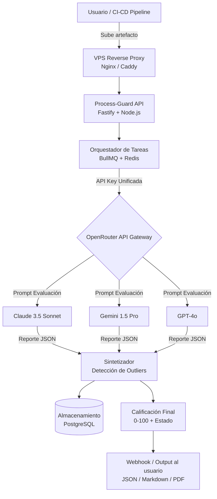

# Figura 1: Arquitectura de Evaluación de Process-Guard

```mermaid
graph TD
    U[Usuario / CI-CD Pipeline] -->|Sube artefacto| VPS[VPS Reverse Proxy\nNginx / Caddy]
    VPS --> API[Process-Guard API\nFastify + Node.js]
    API --> ORCH[Orquestador de Tareas\nBullMQ + Redis]
    
    ORCH -->|API Key Unificada| OR_PROXY{OpenRouter API Gateway}
    
    OR_PROXY -->|Prompt Evaluación| M1[Claude 3.5 Sonnet]
    OR_PROXY -->|Prompt Evaluación| M2[Gemini 1.5 Pro]
    OR_PROXY -->|Prompt Evaluación| M3[GPT-4o]
    
    M1 -->|Reporte JSON| SYNTH[Sintetizador\nDetección de Outliers]
    M2 -->|Reporte JSON| SYNTH
    M3 -->|Reporte JSON| SYNTH
    
    SYNTH --> DB[(Almacenamiento\nPostgreSQL)]
    SYNTH --> CF[Calificación Final\n0-100 + Estado]
    
    CF --> OUT[Webhook / Output al usuario\nJSON / Markdown / PDF]
```
