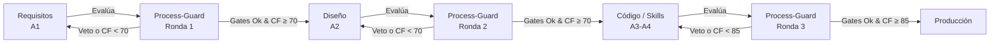

# Figura 2: Ciclo de Vida del Software con Process-Guard

```mermaid
graph LR
    REQ[Requisitos\nA1] -->|Evalúa| PG1[Process-Guard\nRonda 1]
    PG1 -->|Gates Ok & CF ≥ 70| DES[Diseño\nA2]
    PG1 -->|Veto o CF < 70| REQ
    
    DES -->|Evalúa| PG2[Process-Guard\nRonda 2]
    PG2 -->|Gates Ok & CF ≥ 70| COD[Código / Skills\nA3-A4]
    PG2 -->|Veto o CF < 70| DES
    
    COD -->|Evalúa| PG3[Process-Guard\nRonda 3]
    PG3 -->|Gates Ok & CF ≥ 85| PROD[Producción]
    PG3 -->|Veto o CF < 85| COD
```
