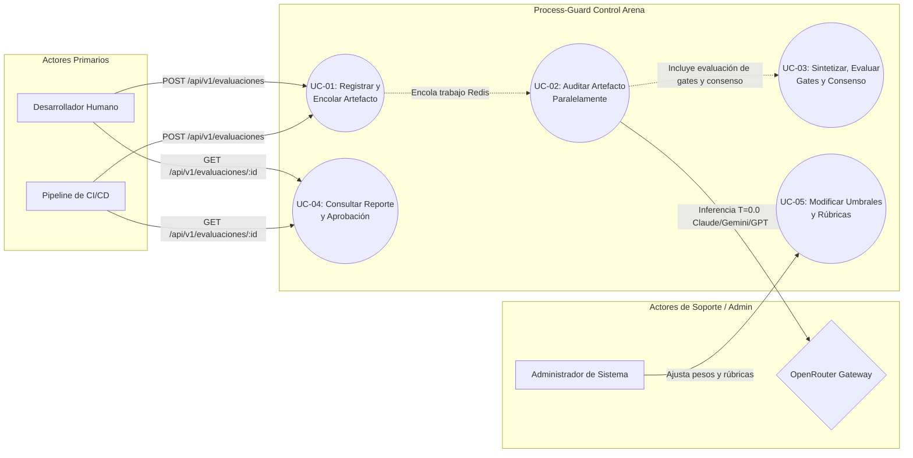

# Figura 3: Diagrama de Casos de Uso (UML)

Este diagrama representa las interacciones clave entre los actores primarios (Desarrollador y Pipeline de CI/CD), el sistema interno (Process-Guard Control Arena, el Orquestador y el Sintetizador) y los actores externos (OpenRouter Gateway y Administrador) bajo el estándar ISO/IEC/IEEE 29148.

